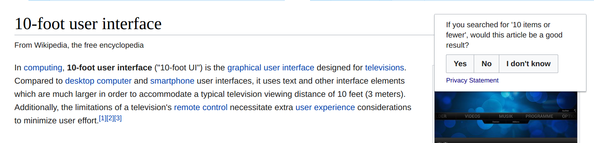

# Search Relevance Surveys

[](https://phabricator.wikimedia.org/F9161493)

Analysis of the 3<sup>rd</sup> running of the search relevance surveys ([T175048](https://phabricator.wikimedia.org/T175048)).

## Setup

```R
# Essentials:
install.packages(c("tidyverse", "caret", "MLmetrics", "mlbench"))
# For bnclassify:
source("https://bioconductor.org/biocLite.R")
biocLite("RBGL"); biocLite("Rgraphviz")
# Classifiers:
install.packages(c("xgboost", "C50", "klaR", "randomForest", "bnclassify"))
```

## TODO

- [x] Tune & train a bunch of classifiers (thanks, caret!)
- [ ] Figure out which sets of features yield the best predictive performance
- [ ] Investigate a multi-level approach based on Discernatron reliability (sort of?)
- [x] Investigate a [stacking / super learning approach](https://github.com/h2oai/h2o-tutorials/tree/master/tutorials/ensembles-stacking)
- [ ] Write-up
