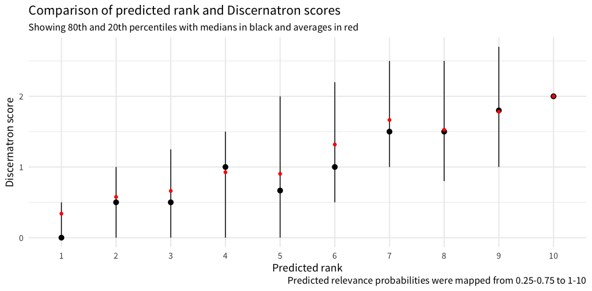

# Predicting Relevance

The model described in [the report](https://wikimedia-research.github.io/Discovery-Search-Adhoc-RelevanceSurveys/) is available for use in production. To generate a prediction of relevance for any query-page combination, the model requires 3 numbers summarizing users' response to the survey:

- **User Score**: (*n*<sub>yes</sub> - *n*<sub>no</sub>) / (*n*<sub>yes</sub> + *n*<sub>no</sub> + 1)
- **Proportion Unsure**: *n*<sub>unsure</sub> / (*n*<sub>yes</sub> + *n*<sub>no</sub> + *n*<sub>unsure</sub> + 1)
- **Engagement**: (*n*<sub>yes</sub> + *n*<sub>no</sub> + *n*<sub>unsure</sub>) / *n*<sub>impressions</sub>

where *n*<sub>impressions</sub> = *n*<sub>yes</sub> + *n*<sub>no</sub> + *n*<sub>unsure</sub> + *n*<sub>dismiss</sub>.

**Note**: it is crucial that the question asked in the search relevance survey is specifically "If someone searched for ‘…’, would they want to read this article?" since that is what the model was trained on.

## Setup

```bash
pip install -r requirements.txt
```

The three major dependencies in [requirements.txt](requirements.txt) are [Keras](https://keras.io/), [TensorFlow](https://www.tensorflow.org/), and [h5py](http://www.h5py.org/). The example below uses [Pandas](https://pandas.pydata.org/) to load [example.csv](example.csv) but that library is not required to generate predictions.

## Usage

```python
import pandas as pd
df = pd.read_csv('example.csv')
features = df[['user_score', 'prop_unsure', 'engagement']].values
```

`features` has 1,449 rows and 3 columns (one column for each feature). The saved model is contained in the HDF5 file [relevance-classifier.h5](relevance-classifier.h5). Once loaded, we can request a probability of relevance for each instance:

```python
import keras
model = keras.models.load_model('relevance-classifier.h5')
model.predict(features)
```

### Predicting Rank

The predictions returned will be on the scale 0.0-1.0, although we've observed the maximum to be 0.75 in practice. So what we could do is restrict the predicted probabilities to [0.25, 0.75] and then map those to [0, 1] and map those to a 1-10 ranking (which the ranking learner expects as response in the training data). When we compare the predicted ranks (using this mapping system) with Discernatron scores, we get remarkably good results all things considered:



See [T175048#3852241](https://phabricator.wikimedia.org/T175048#3852241) for more details.

The following function accomplishes this:

```python
import numpy as np

def prob2rank(probs, old_min=0.25, old_max=0.75):
  new_min = 1e-6
  new_max = 1
  restricted = np.minimum(np.maximum(probs, old_min), old_max)
  rescaled = ((new_max - new_min) * (restricted - old_min) / (old_max - old_min)) + new_min
  rankings = np.ceil(10 * rescaled)
  return rankings
```

Then we can use it as follows:

```python
predicted_probabilities = model.predict(features)
prob2rank(predicted_probabilities)
```

## Evaluation

The performance of the model on the example data can also be evaluated as follows:

```python
labels = df['label'].values
model.evaluate(features, labels)
```

This will return the loss and the accuracy.
